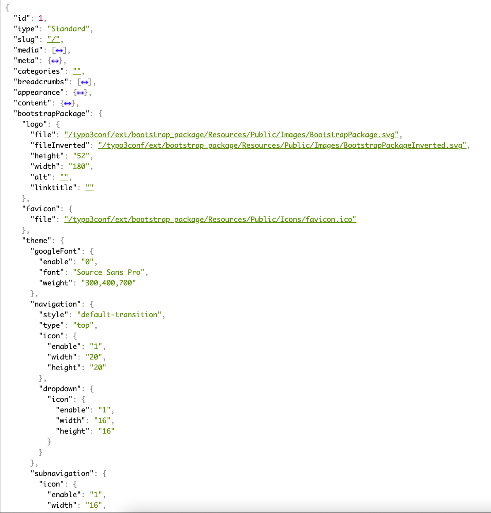
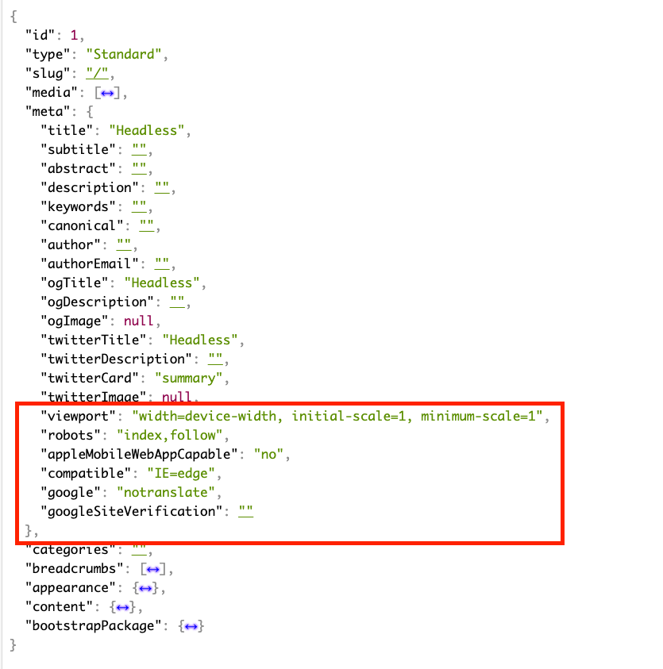

[](https://github.com/vshymanskyy/StandWithUkraine/blob/main/docs/README.md)
[](https://get.typo3.org/version/11)
[](https://get.typo3.org/version/11)
[](https://github.com/FriendsOfTYPO3Headless/headless_bootstrap_package/actions)
[](https://github.com/FriendsOfTYPO3Headless/headless_bootstrap_package/blob/code-coverage-badge/clover.xml)
[](https://packagist.org/packages/friendsoftypo3headless/headless-bootstrap-package)
[](https://packagist.org/packages/friendsoftypo3headless/headless-bootstrap-package)
[](https://packagist.org/packages/friendsoftypo3headless/headless-bootstrap-package)
[](https://packagist.org/packages/friendsoftypo3headless/headless-bootstrap-package)

# TYPO3 Extension "headless_bootstrap_package" - Provides TypoScript definitions for proper JSON output from EXT:bootstrap_package content elements and configuration

This extension provides integration
for [EXT:bootstrap_package](https://github.com/benjaminkott/bootstrap_package)
with [EXT:headless](https://github.com/TYPO3-Headless/headless).

It provides TypoScript rendering definitions for all of EXT:bootstrap_packages
ContentElements to output them as proper JSON.

## Requirements

This Extension requires:

- [TYPO3](https://github.com/TYPO3) in version at least 11.5
- [EXT:headless](https://github.com/TYPO3-Headless/headless) in version at least
  3.0.3
- [EXT:bk2k/bootstrap-package](https://github.com/benjaminkott/bootstrap_package)
  in version at least 12.0


## TYPO3 Installation

Install extension using composer\
``composer require friendsoftypo3headless/headless-bootstrap-package``

and then, include TypoScript template, and you are ready to go.

**Important**: Do **NOT** include the Setup/Constants provided by EXT:
bootstrap_package since they would interfere with the EXT:headless page
config. <br><br>
Instead please include the provided "Headless Boostrap Package: Boostrap Package
Constants" TypoScript config in order to gain access to the EXT:
bootstrap_package constants.

This extension adds a "bootstrapPackage" key to every JSON page reponse
containing the EXT:bootstrap_package constants/config:


It also merges the page.meta constants into the page.meta JSON array:


## Testing

This Extension comes with a phpunit testsuite with functional tests for all
content elements.<br>
To run the tests simply use the provided composer script:

```composer ci:test```

## Credits

A special thanks goes
to [TRIXIE Heimtierbedarf GmbH & Co. KG](https://www.trixie.de), which is
sponsoring development of this extension.

## Developers involved in the project

- [Sven Petersen](https://github.com/svenpet90) ([DAUSKONZEPT GmbH](https:///www.dauskonzept.de) && [HardAnders GbR](https://www.hardanders.de))
- [Niels Seelhöfer](https://github.com/derseeli) ([TRIXIE Heimtierbedarf GmbH & Co. KG](https://www.trixie.de) && [Datenanker](https://www.datenanker.com))
